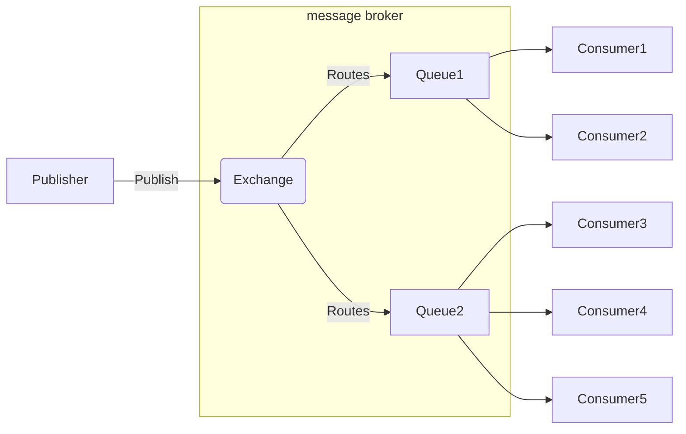

# Rabbitmq

[TOC]

## 简介

rabbitmq是一种基于AMQP（高级消息队列协议）的消息代理，它可以接受、存储和转发消息，但是不会去处理消息。

消息代理（message broker）从生产者那里接收消息，并根据一定的规则把消息发送给消费者。

AMQP是一种网络协议，可以让支持该协议的客户端和消息代理之间进行通信。其工作原理大概如下图：




### Exchange

Publisher发送消息不会直接发送到Queue中，而是先直接发送到交换机Exchange，Publisher并不知道消息已经发送到队列。也就是说Exchange承担着Publisher和Queue之间的桥梁，其一边从Publisher接收消息，一边向Queue投递消息。

当一个消息到达Exchange后，RabbitMQ会根据预先设定好的规则决定消息该投递到哪个Queue或者多个Queue。这些规则是通过Exchange type和`routing key`来定义的。

Binding: Exchange和Queue之间的联系称之为Binding(绑定)。

Routing key: 类似于Queue的地址，指明了Exchange中的消息应该分发到哪个满足条件的Queue中去。

**如果将消息发送到一个没有队列绑定的exchange上面，那么该消息将会丢失，这是因为在rabbitmq中exchange是不具备存储消息的能力，只有队具备存储消息的能力。**

Rabbitmq提供了四种Exchange type：

- **direct**：将消息中的`routing key`与该Exchange关联的所有绑定的Queue中的`routing key`进行比较，如果完全匹配，则发送到该Queue中。
- **topic**：将消息中的`routing key`与该Exchange所有绑定的Queue中的`routing key`进行某种模式的匹配比较，如果匹配上了，则发送到该Queue中。符号“#”表示一个或多个词，符号“*”表示一个词。
- **fonout**：消息转发的时候会忽略`routing key`，直接把消息投递到所有和Exchange绑定的Queue中，如果Exchange没有和任何Queue绑定，则消息会被丢弃。
- **headers**：这种类型的Exchange适用于当消息的路由操作涉及多个属性的时候，相比于`routing key`，headers exchange使用多个消息属性来建立路由规则，Exchange需要考虑某条消息是需要部分匹配还是全部匹配这些消息属性，并与该Exchange所有绑定的Queue中的消息属性进行匹配，如果匹配上了，则发送到该Queue中。

### Consumer

Rabbitmq采用的是Round Robin的轮询调度算法，也就是说不会因为某个消费者消费能力强就消费更多的消息，而是你一个我一个地轮流给消费者分发消息。Consumer和Producer都try to create the queue。

### VHost

每一个RabbitMQ服务器都能创建虚拟消息服务器，我们称之为虚拟主机。每一个vhost本质上是一个mini版的RabbitMQ服务器，拥有自己的交换机、队列、绑定等，拥有自己的权限机制。vhost之于Rabbit就像虚拟机之于物理机一样。他们通过在各个实例间提供逻辑上分离，允许为不同的应用程序安全保密的运行数据，这很有，它既能将同一个Rabbit的众多客户区分开来，又可以避免队列和交换器的命名冲突。RabbitMQ提供了开箱即用的默认的虚拟主机“/”，如果不需要多个vhost可以直接使用这个默认的vhost，通过使用缺省的guest用户名和guest密码来访问默认的vhost。

vhost之间是相互独立的，这避免了各种命名的冲突，就像App中的沙盒的概念一样，每个沙盒是相互独立的，且只能访问自己的沙盒，以保证非法访问别的沙盒带来的安全隐患。

### Channel

channel 是真实 TCP 连接之上的虚拟连接，每条TCP连接上的信道数量没有限制，所有 AMQP 命令都是通过 channel 发送的，且每一个 channel 有唯一的 ID 。


## 安装

```bash
$ yum -y install erlang
$ wget http://www.rabbitmq.com/releases/rabbitmq-server/v3.6.6/rabbitmq-server-3.6.6-1.el6.noarch.rpm
$ yum -y install rabbitmq-server-3.6.6-1.el6.noarch.rpm
```

```bash
# 查看rabbitmq服务状态
$ service rabbitmq-server status
# 查看rabbitmq插件
$ rabbitmq-plugins list
# 启动rabbitmq web管理后台，默认端口15672
$ rabbitmq-plugins enable rabbitmq_management
# 创建用户和密码
$ rabbitmqctl add_user username password
# 赋予用户角色, tag可以为administrator, monitoring, policymarker, management或者其它自定义tag
$ rabbitmqctl set_user_tags username tags
# 查看用户权限
$ rabbitmqctl list_user_permissions username
# 设置用户权限
$ rabbitmqctl set_permissions [-p <vhost>] <user> <conf> <write> <read> 
```


## 基本用法

`pika == 0.12.0`

**生产者**：

```python
import time
import pika

credentials = pika.PlainCredentials('test', 'test1234')
# virtual_host 指明了客户端要使用哪个虚拟环境，虚拟环境为消息代理实现了多个隔离的环境。
connection_param = pika.ConnectionParameters(
    host='111.230.184.76',
    credentials=credentials,
    virtual_host='test_vhost'
)
connection = pika.BlockingConnection(connection_param)
# 新建channel，rabbitmq不会为每个连接建立TCP连接，而是在一个TCP连接上建立一个Channel。
# channel可以看作是一个TCP连接的轻量化连接，但是channel不能被线程/进程共享，不同channel之间的通信是相互隔离的
channel = connection.channel()
# 创建exchange
exchange = 'test_fanout'
channel.exchange_declare(exchange=exchange, exchange_type='fanout')

# 发布信息
count = 0
while count < 30:
    channel.basic_publish(exchange=exchange, routing_key='', body='{0}: Hello World'.format(count))
    time.sleep(2)
    count += 1

connection.close()
```

**消费者**：

```python
import pika

credentials = pika.PlainCredentials('test', 'test1234')
connection_param = pika.ConnectionParameters(
    host='111.230.184.76',
    credentials=credentials,
    virtual_host='test_vhost'
)
connection = pika.BlockingConnection(connection_param)
channel = connection.channel()
# exclusive = True 表示队列只能在当前连接中被访问
# auto_delete = True 表示队列是临时队列，connection关闭的时候这个队列会被删除
queue = channel.queue_declare(exclusive=True, auto_delete=True)
queue_name = queue.method.queue
channel.queue_bind(exchange='test_fanout', queue=queue_name)


def callback(ch, method, properties, body):
    print("recv msg: {0}".format(body))


channel.basic_consume(consumer_callback=callback, queue=queue_name)
channel.start_consuming()

connection.close()
```


## Push or Pull

RabbitMQ的消费模式就是兼具Push和Pull。

**push**

channel.basic_consume

订阅某一个队列中的消息，broker端主动向client端发送的数据，client端没有请求。除非关闭channel或者取消订阅，否则客户端将会一直接收队列的消息。

**pull**

channel.basic_get。broker端不会在client端没有请求的情况下来回传消息。

不可以通过循环调用basic_get来代替basic.consume，因为basic_get是主动去broker请求才会有数据返回，即每次调用都需要建立连接，然后获取数据，断开连接。如果是高吞吐率的消费者，最好还是建议使用basic.consume。


## 死信队列

死信队列介绍

- 死信队列：DLX，`dead-letter-exchange`
- 利用DLX，当消息在一个队列中变成死信 `(dead message)` 之后，它能被重新publish到另一个Exchange，这个Exchange就是DLX

消息变成死信有以下几种情况

- 消息被拒绝(basic.reject / basic.nack)，并且requeue = false
- 消息TTL过期
- 队列达到最大长度

死信处理过程

- DLX也是一个正常的Exchange，和一般的Exchange没有区别，它能在任何的队列上被指定，实际上就是设置某个队列的属性。
- 当这个队列中有死信时，RabbitMQ就会自动的将这个消息重新发布到设置的Exchange上去，进而被路由到另一个队列。
- 可以监听这个队列中的消息做相应的处理。

在声明队列时，需要声明两个参数即可：`x-dead-letter-exchange`，`x-dead-letter-routing-key`。同时在声明普通队列之前声明死信队列：

```python
# 定义死信队列交换器
channel.exchange_declare("alert_ex_dlx",durable=True) 
channel.queue_declare(queue='alert_dlx', durable=True)
channel.queue_bind(queue="alert_dlx", 
                   exchange="alert_ex_dlx", 
                   routing_key="dlx_key")

# 定义普通队列和交换器
channel.exchange_declare(exchange='alert_ex', durable=True)
channel.queue_declare(queue='alert', 
                      durable=True,
                      arguments={
                        "x-dead-letter-exchange": "alert_ex_dlx",
                        "x-dead-letter-routing-key": "dlx_key",
                        "x-message-ttl": 100000}) 
channel.queue_bind(queue="alert", 
                   exchange="alert_ex", 
                   routing_key="alert_routing_key")

```


## 延时队列

所谓延迟队列，指的是消息发送后，并不想立即被消费者拿到，希望在指定时间后，消费者才拿到消息。

延迟队列可以用死信队列来实现。利用队列或消息的 TTL 特性，可以做到消息在指定时间内超时后被路由到死信队列，而此时死信队列就可以当做延迟队列来做消息处理。在普通队列的死信设置里加上一条 `x-message-ttl` 就可以设置消息的 TTL。`x-message-ttl`的单位是milliseconds。


##持久化

### exchange持久化

```python
channel.exchange_declare(exchange='durable_exchange', durable=True)
```

### 队列持久化

持久化的队列会存储在磁盘里，当消息代理重启的时候依然存在，持久化的队列不会使得消息持久化，当消息代理重启时持久化过的队列会被重新声明，但是消息不会重新恢复。

```python
channel.queue_declare(queue='durable_queue', durable=True)
```

生产者和消费者必须同时声明持久化队列，不然消费者会报错。

### 消息持久化

```python
channel.basic_publish(exchange='', 
                      routing_key='', 
                      body='hello world', 
                      properties=pika.BasicProperties(delivery_mode=2))
```

delivery_mode = 2 声明了消息持久化的属性


## 消息确认

消息代理有两种删除消息的方式：

- 当消息代理把消息发送给消费者后立刻删除。
- 当消息代理发送完消息后，等待消费者回发一个消息确认后再删除消息。如果接收到消息的消费者未发送消息确认的情况下挂掉，消息代理会把消息重新投递给另外一个消费者，如果没有可用消费者，消息代理会死等下一个注册到该队列的消费者再投递消息。

```python
channel.basic_consume(consumer_callback=callback, queue='test_queue', no_ack=True)
```

`no_ack` 默认为`False`。


## 事务

采用事务机制实现会降低RabbitMQ的消息吞吐量，事务的交互流程如下：

 1、客户端发送给服务器 Tx.Select（开启事务模式）
 2、服务器端返回 Tx.Select-Ok（开启事务模式ok）
 3、推送消息
 4、客户端发送给事务提交 Tx.Commit
 5、服务器端返回 Tx.Commit - Ok


## 确保消息不丢失

### 生产者

可能存在情况：

1. 消息发送后没有投放到指定队列。

发送方将信道设置成confirm (确认)模式, 一旦这样设置，这个信道上所有发布的消息都会被指定一个唯一的ID，消息被投递到所匹配的队列后，rabbitmq会发送一个包含消息唯一ID的确认信息给生产者，使生产者知道消息送达。

```python
# ...
# Turn on delivery confirmations
channel.confirm_delivery()
try:
    channel.basic_publish(exchange=exchange, routing_key='test', body='HelloWorld')
except Exception as e:
    print(e)
```

将当前的信道设置成事务模式后，可以显示提交事物，如果事物成功，则消息一定送达，如果不成功，可以回滚后重新发送。但是有性能损失。

```python
try:
		channel.tx_select() # 开启事物
		channel.basic_publish(exchange=exchange, routing_key='test', body='HelloWorld')
		channel.tx_commit() # 提交事物
except Exception as e:
		print(e)
		channel.tx_rollback() # 回滚事物
```

2. 消息routing_key不存在。

```python
def _basic_publish(self, msg, exchange='', routing_key='',
                   mandatory=False, immediate=False, timeout=None,
                   argsig='Bssbb'):
		"""
		mandatory: boolean
    indicate mandatory routing

    This flag tells the server how to react if the message cannot be routed to a queue.  
    If this flag is True, the server will return an unroutable message with a Return 
    method.  If this flag is False, the server silently drops the message.
    """       
    pass
```


### Broker

**持久化**

1. 队列持久化:定义队列时，设置队列的durable=True。服务重启后，队列不会丢失。

2. 交换器持久化:定义交换器时，设置durable=True。服务重启后，交换器元数据不会丢失，但是里面不保存消息。

3. 消息持久化: 将投递模式设置为2即可。服务重启后，队列里的消息不会丢失。

**高可用** 

​	设置 镜像队列


### 消费者

当消费者接收到消息后发生异常，没有正常消费消息

设置autoAck=False，关闭自动ack，真正处理完成后，手动发送完成确认。如果没有ack确认 且当前消费者链接断开，任务会重新进入队列。

**自动ack有个弊端**，只要队列不空，RabbitMQ会源源不断的把消息推送给客户端，而不管客户端能否消费的完

```python
def callback(ch, method, properties, body):
    try:
        print(f"msg:{body}")
    except Exception as e:
        print(e)
    else:
        ch.basic_ack(delivery_tag=method.delivery_tag) # 手动 发送 真正任务完成 发送ack确认 如果没有ack确认 且当前消费者链接断开，任务会重新进入队列

channel.basic_consume(on_message_callback=callback, queue='queue', auto_ack=False) # 关闭auto_ack
```
但是如果callback触发了一个bug，导致所有消息都抛出异常，然后队列的Unacked消息数暴涨，导致MQ响应越来越慢，甚至崩溃的问题。
原因是如果MQ没得到ack响应，这些消息会堆积在Unacked消息里，不会抛弃，直至客户端断开重连时，才变回ready；
如果Consumer客户端不断开连接，这些Unacked消息，永远不会变回ready状态，Unacked消息多了，占用内存越来越大，就会异常了。
这时就需要`channel.basic_nack`方法了，这个方法指明了**消费异常情况下该条消息怎么处理**，有两种办法：第一，这条消息重新放回队列重新消费，第二，抛弃此条消息。

```python
def callback(ch, method, properties, body):  
    try:
        print(f"msg:{body}")
        assert 1==0		# "模拟出问题"
    except Exception as e:
        print(e)
        ch.basic_nack(delivery_tag=method.delivery_tag, requeue=True) # 发送nack, requeue=True, 拒绝消息并重新发送到队列 发送到队列的信息再收到还是会再次拒绝，进入死循环
        #ch.basic_reject(delivery_tag=method.delivery_tag, requeue=True) # 拒绝消息并重新发送到队列 发送到队列的信息再收到还是会再次拒绝，进入死循环
    else:
      	# 如果没有发生异常，执行else内代码
        ch.basic_ack(delivery_tag=method.delivery_tag) # 手动 发送 真正任务完成 发送ack确认 如果没有ack确认 且当前消费者链接断开，任务会重新进入队列
        
channel.basic_consume(on_message_callback=callback, queue='queue', auto_ack=False) # 关闭auto_ack
```
如果消息本身有问题，消费者抛出异常后把该消息重新发回队列中，队列又把该消息发回消费者，继续抛异常继续发回队列，就出现死循环的情况。

解决方法：开启死信队列，并设置`basic_nack`/`basic_reject`的requeue=False。这时当消息被拒绝或者nack时会被送入死信队列。消息过期，nack,reject,队列最大长度 这些情况，如果开启了死信队列，消息都会进入死信队列）。分析死信队列上的异常情况可以用来改善和优化系统。


## 避免消息重复投递或重复消费

**消息投递**

MQ内部针对每条生产者发送的消息生成一个inner-msg-id，作为去重和幂等的依据（消息投递失败并重传），避免重复的消息进入队列；或者重复投递没关系，只要保证我消费者端不重复消费就可以。

**消息消费**

要求消息体中必须要有一个bizId（对于同一业务全局唯一，如支付ID、订单ID、帖子ID等）作为去重和幂等的依据，避免同一条消息被重复消费。

1. 你拿到这个消息做数据库的insert操作。那就容易了，给这个消息做一个唯一主键，那么就算出现重复消费的情况，就会导致主键冲突，避免数据库出现脏数据。
2. 再比如，你拿到这个消息做redis的set的操作，那就容易了，不用解决，因为你无论set几次结果都是一样的，set操作本来就算幂等操作。
  

## 集群

### 概况

RabbitMQ的集群是由多个节点组成的，但不是每个节点都有所有队列的完全拷贝。

有两个原因：

1. 存储空间——如果每个节点都拥有所有队列的完全拷贝，这样新增节点不但没有新增存储空间，反而增加了更多的冗余数据。
2. 性能——如果消息的发布需安全拷贝到每一个集群节点，那么新增节点对网络和磁盘负载都会有增加，这样违背了建立集群的初衷，新增节点并没有提升处理消息的能力，最多是保持和单节点相同的性能甚至是更糟。

所以其他非所有者节点只知道队列的元数据，和指向该队列节点的指针。

节点的存储类型分为两种：

- 磁盘节点
- 内存节点

磁盘节点就是配置信息和元信息存储在磁盘上，内次节点把这些信息存储在内存中，当然内次节点的性能是大大超越磁盘节点的。

**单节点系统必须是磁盘节点**，否则每次你重启RabbitMQ之后所有的系统配置信息都会丢失。

**RabbitMQ要求集群中至少有一个磁盘节点**，为了避免异常出现，最好是两个磁盘节点。当节点加入和离开集群时，必须通知磁盘节点。如果唯一磁盘的磁盘节点崩溃，集群是可以保持运行的，但你不能更改任何东西。因为其他节点保存了queue，exchange等元数据，

**集群重启的顺序是固定的，并且是相反的。** 如下所述：

- 启动顺序：磁盘节点 => 内存节点
- 关闭顺序：内存节点 => 磁盘节点

**最后关闭必须是磁盘节点**，不然可能回造成集群启动失败、数据丢失等异常情况。

### 新增节点

节点加入集群流程如下：

（1）新增节点先从 gm_group 中获取对应 group 成员信息；

（2）随机选择一个节点并向这个节点发送加入请求；

（3）集群节点收到新增节点请求后，更新 gm_group 对应信息，同时更新左右节点更新邻居信息（调整对左右节点的监控）；

（4）集群节点回复通知新增节点成功加入 group；

（5）新增节点收到回复后更新 rabbit_queue 中的相关信息，同时根据策略同步消息。

### 删除节点

当 Slave 节点失效时，仅仅是相邻节点感知，然后重新调整邻居节点信息，更新 rabbit_queue, gm_group的记录。

当 Master 节点失效时流程如下：

（1）由于所有 mirror_queue_slave进程会对 amqqueue_process 进程监控，如果 Master 节点失效，mirror_queue_slave感知后通过 GM 进行广播；

（2）**存活最久的 Slave 节点**会提升自己为 master 节点；

（3）该节点会创建出新的 coordinator，并通知 GM 进程修改回调处理器为 coordinator；

（4）原来的 mirror_queue_slave 作为 amqqueue_process 处理生产发布的消息，向消费者投递消息。

### 镜像队列

引入镜像队列（Mirror Queue）的机制，可以将队列镜像到集群中的其他 Broker 节点之上，如果集群中的一个节点失效了，**队列能够自动切换到镜像中的另一个节点上以保证服务的可用性**。

对每个队列的（以下简称镜像队列）都包含一个主节点（master）和若干个从节点（slave）。slave 会准确地按照 maste 执行命令地顺序进行动作，故 slave 和 master 上维护的状态应该是相同的。如果 master 由于某种原因失效，那么“**资历最老**”（根基于 slave 加入 cluster 的时间排序）的 slave 会被提升为新的 master。**新的master节点requeue所有unack消息**，因为这个新节点无法区分这些unack消息是否已经到达客户端，亦或是ack消息丢失在老的master的链路上，亦或者是丢在master组播ack消息到所有slave的链路上。所以处于消息可靠性的考虑，requeue所有unack的消息。此时客户端可能有重复消息。

如果消费者与 slave 建立连接并进行订阅消费，其实质都是从 master 上获取消息，只不过看似是从 slave 上消费而已。比如消费者与 slave 建立了 TCP 连接之后执行一个 Basic.Get 操作，那么首先是由  slave 将Basic.Get 请求发往 master，再由 **master 准备好数据返回给 slave**，最后由 slave 投递给消费者。

镜像队列的配置主要是通过添加相应的 Policy 来完成的，对于镜像队列的配置来说，definition 中需要包含 3 个部分：`ha-mode`、`ha-params`、`ha-sync-mode`

- `ha-mode`：指明镜像队列的模式，有效值为all 、exactly 、nodes ，默认为all 。all 表示在集群中所有的节点上进行镜像；exactly 表示在指定个数的节点上进行镜像，节点个数由ha - params 指定； nodes 表示在指定节点上进行镜像，节点名称通过 ha-params 指定，节点的名称通常类似于 rabbit@hostname ，可以通过`rabbitmqctl cluster status` 命令查看到。
- `ha-params`：不同的 `ha-mode` 配置中需要用到的参数。
- `ha-sync-mode`：队列中消息的同步方式，有效值为 automatic 和 manually（默认）。

**manually**：新节点加入到镜像队列组后，可以从左节点获取当前正在广播的消息，但是在加入之前已经广播的消息无法获取，所以会处于镜像队列之间数据不一致的情况，在加入之前的消息都被消费后，主从镜像队列数据保持一致。当加入之前的消息未全部消费完之前，主节点宕机，新节点选为主节点时，这部分消息将丢失。

**automatic**：新加入组群的 Slave 节点会自动进行消息同步，使主从镜像队列数据保持一致。

镜像队列中每个进程会创建一个 gm（guaranteed multicast）进程，镜像队列中所有 gm 进程会组成一个进程组用于广播和接收消息。

镜像队列 gm 组通过将所有 gm 进程形成一个循环链表，每个 gm 都会监控位于自己左右两边的 gm，当有 gm 新增时，相邻的 gm 保证当前广播的消息会通知到新的 gm 上；当有 gm 失效时，相邻的 gm 会接管保证本次广播消息会通知到所有 gm。

 gm 组信息会记录在本地数据库（mnesia）中，不同的镜像队列行程的 gm 组也是不同的。

消息从 master 队列对应的 gm 发出后，顺着链表依次传送到所有 gm 进程，由于所有 gm 进程组成一个循环链表，master 队列的 gm 线程最终会收到自己发送的消息，这个时候 master 队列就知道消息已经复制到所有 slave 队列了。

**消息广播流程**如下：

（1）Master 节点发出消息，顺着镜像队列循环列表发送；

（2）所有 Slave 节点收到消息会对消息进行缓存（Slave 节点缓存消息用于在广播过程中，有节点失效或者新增节点，这样左侧节点感知变化后会重新将消息推送给右侧节点）；

（3）当 Master 节点收到自己发送的消息后意味着所有节点都收到了消息，会再次广播 Ack 消息；

（4）Ack 消息同样会顺着循环列表经过所有 Slave 节点，通知 Slave 节点可以清除缓存消息；

（5）当 Ack 消息回到 Master 节点，对应消息的广播结束。


## 与Redis对比

**可靠性**

redis ：没有相应的机制保证消息的可靠消费，如果发布者发布一条消息，而没有对应的订阅者的话，这条消息将丢失，不会存在内存中；
rabbitmq：具有消息消费确认机制，如果发布一条消息，还没有消费者消费该队列，那么这条消息将一直存放在队列中，直到有消费者消费了该条消息，以此可以保证消息的可靠消费；

**实时性**

redis:实时性高，redis作为高效的缓存服务器，所有数据都存在在服务器中，所以它具有更高的实时性

**消费者负载均衡**

rabbitmq**队列**可以被多个消费者同时监控消费，但是每一条消息只能被消费一次，由于rabbitmq的消费确认机制，因此它能够根据消费者的消费能力而调整它的负载；
redis发布订阅模式，一个队列可以被多个消费者同时订阅，当有消息到达时，会将该消息依次发送给每个订阅者；

**持久性**

redis：redis的持久化是针对于整个redis缓存的内容，它有RDB和AOF两种持久化方式（redis持久化方式，后续更新），可以将整个redis实例持久化到磁盘，以此来做数据备份，防止异常情况下导致数据丢失。
rabbitmq：队列，消息都可以选择性持久化，持久化粒度更小，更灵活；

**队列监控**

rabbitmq实现了后台监控平台，可以在该平台上看到所有创建的队列的详细情况，良好的后台管理平台可以方面我们更好的使用；
redis没有所谓的监控平台。

**事务**

rabbitmq支持事务，redis不支持事务

**总结**

redis：    轻量级，低延迟，高并发，低可靠性；
rabbitmq：重量级，高可靠，异步，不保证实时；
rabbitmq是一个专门的AMQP协议队列，他的优势就在于提供可靠的队列服务，并且可做到异步，而redis主要是用于缓存的，redis的发布订阅模块，可用于实现及时性，且可靠性低的功能。


## 一些问题

1. `error(-1, "ConnectionResetError(104, 'Connection reset by peer')")`

   原因：长时间没有数据来往服务断开了连接。

   处理：`heartbeat=600`，`heartbeat`并不是心跳发送的间隔，而是这么长时间没有与服务端通信则断开连接，在这个问题上可以尝试把`heartbeat`值调高。

   或者在每次发布消息前先判断连接状态（这个似乎并没啥用）：

   ```python
     if connection.is_closed or channel.is_closed:
         reset_conn_and_channel()
   ```

2. ```shell
   Task handler raised error: "TimeLimitExceeded(500,)" on_hard_timeout billiard/pool.py billiard.pool in on_hard_timeout
   ```

   原因：celery上配置了任务超时时间，超时了就把消费者worker kill了

   处理：改用task_soft_time_limit并捕获SoftTimeLimitExceeded异常。


