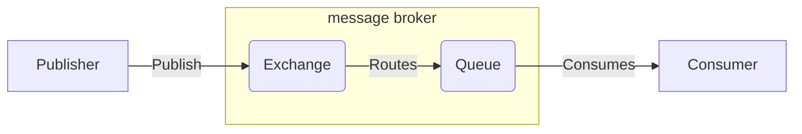
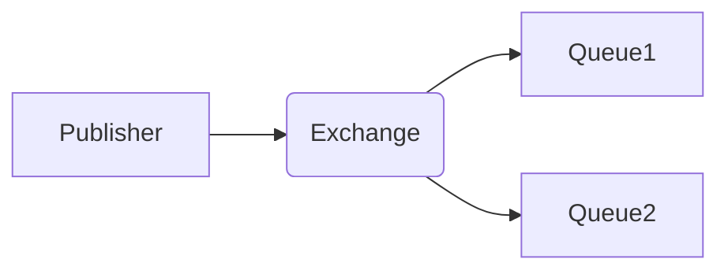

# Rabbitmq

[TOC]

## 简介

rabbitmq是一种基于AMQP（高级消息队列协议）的消息代理，它可以接受、存储和转发消息，但是不会去处理消息。

消息代理（message broker）从生产者那里接收消息，并根据一定的规则把消息发送给消费者。

AMQP是一种网络协议，可以让支持该协议的客户端和消息代理之间进行通信。其工作原理大概如下图：



### Exchange

Publisher发送消息不会直接发送到Queue中，而是先直接发送到交换机Exchange，Publisher并不知道消息已经发送到队列。也就是说Exchange承担着Publisher和Queue之间的桥梁，其一边从Publisher接收消息，一边向Queue投递消息。

当一个消息到达Exchange后，RabbitMQ会根据预先设定好的规则决定消息该投递到哪个Queue或者多个Queue。这些规则是通过Exchange type和`routing key`来定义的。

Binding: Exchange和Queue之间的联系称之为Binding(绑定)。

Routing key: 类似于Queue的地址，指明了Exchange中的消息应该分发到哪个满足条件的Queue中去。

Rabbitmq提供了四种Exchange type：

- **direct**：将消息中的`routing key`与该Exchange关联的所有绑定的Queue中的`routing key`进行比较，如果完全匹配，则发送到该Queue中。
- **topic**：将消息中的`routing key`与该Exchange所有绑定的Queue中的`routing key`进行某种模式的匹配比较，如果匹配上了，则发送到该Queue中。符号“#”表示一个或多个词，符号“*”表示一个词。
- **fonout**：消息转发的时候会忽略`routing key`，直接把消息投递到所有和Exchange绑定的Queue中，如果Exchange没有和任何Queue绑定，则消息会被丢弃。
- **headers**：这种类型的Exchange适用于当消息的路由操作涉及多个属性的时候，相比于`routing key`，headers exchange使用多个消息属性来建立路由规则，Exchange需要考虑某条消息是需要部分匹配还是全部匹配这些消息属性，并与该Exchange所有绑定的Queue中的消息属性进行匹配，如果匹配上了，则发送到该Queue中。





## 安装

```bash
$ yum -y install erlang
$ wget http://www.rabbitmq.com/releases/rabbitmq-server/v3.6.6/rabbitmq-server-3.6.6-1.el6.noarch.rpm
$ yum -y install rabbitmq-server-3.6.6-1.el6.noarch.rpm
```

```bash
# 查看rabbitmq服务状态
$ service rabbitmq-server status
# 查看rabbitmq插件
$ rabbitmq-plugins list
# 启动rabbitmq web管理后台，默认端口15672
$ rabbitmq-plugins enable rabbitmq_management
# 创建用户和密码
$ rabbitmqctl add_user username password
# 赋予用户角色, tag可以为administrator, monitoring, policymarker, management或者其它自定义tag
$ rabbitmqctl set_user_tags username tags
# 查看用户权限
$ rabbitmqctl list_user_permissions username
# 设置用户权限
$ rabbitmqctl set_permissions [-p <vhost>] <user> <conf> <write> <read> 
```


## 基本用法

`pika == 0.12.0`

生产者：

```python
import time

import pika


credentials = pika.PlainCredentials('test', 'test1234')
# virtual_host 指明了客户端要使用哪个虚拟环境，虚拟环境为消息代理实现了多个隔离的环境。
connection_param = pika.ConnectionParameters(
    host='111.230.184.76',
    credentials=credentials,
    virtual_host='test_vhost'
)
connection = pika.BlockingConnection(connection_param)
# 新建channel，rabbitmq不会为每个连接建立TCP连接，而是在一个TCP连接上建立一个Channel。
# channel可以看作是一个TCP连接的轻量化连接，但是channel不能被线程/进程共享，不同channel之间的通信是相互隔离的
channel = connection.channel()
# 创建exchange
exchange = 'test_fanout'
channel.exchange_declare(exchange=exchange, exchange_type='fanout')

# 发布信息
count = 0
while count < 30:
    channel.basic_publish(exchange=exchange, routing_key='', body='{0}: Hello World'.format(count))
    time.sleep(2)
    count += 1

connection.close()
```

消费者：

```python
import pika

credentials = pika.PlainCredentials('test', 'test1234')
connection_param = pika.ConnectionParameters(
    host='111.230.184.76',
    credentials=credentials,
    virtual_host='test_vhost'
)
connection = pika.BlockingConnection(connection_param)
channel = connection.channel()
# exclusive = True 表示队列只能在当前连接中被访问
# auto_delete = True 表示队列是临时队列，connection关闭的时候这个队列会被删除
queue = channel.queue_declare(exclusive=True, auto_delete=True)
queue_name = queue.method.queue
channel.queue_bind(exchange='test_fanout', queue=queue_name)


def callback(ch, method, properties, body):
    print("recv msg: {0}".format(body))


channel.basic_consume(consumer_callback=callback, queue=queue_name)
channel.start_consuming()

connection.close()
```

## 进阶

### 持久化

#### 队列持久化

持久化的队列会存储在磁盘里，当消息代理重启的时候依然存在，持久化的队列不会使得消息持久化，当消息代理重启时持久化过的队列会被重新声明，但是消息不会重新恢复。

```python
channel.queue_declare(queue='durable_queue', durable=True)
```

生产者和消费者必须同时声明持久化队列，不然消费者会报错。

#### 消息持久化

```python
channel.basic_publish(exchange='', 
                      routing_key='', 
                      body='hello world', 
                      properties=pika.BasicProperties(delivery_mode=2))
```

delivery_mode = 2 声明了消息持久化的属性

### 消息确认

消息代理有两种删除消息的方式：

- 当消息代理把消息发送给消费者后立刻删除。
- 当消息代理发送完消息后，等待消费者回发一个消息确认后再删除消息。如果接收到消息的消费者未发送消息确认的情况下挂掉，消息代理会把消息重新投递给另外一个消费者，如果没有可用消费者，消息代理会死等下一个注册到该队列的消费者再投递消息。

```python
channel.basic_consume(consumer_callback=callback, queue='test_queue', no_ack=True)
```

`no_ack` 默认为`False`。

