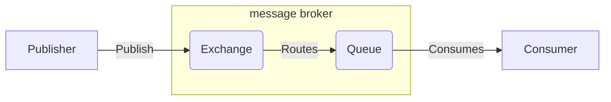
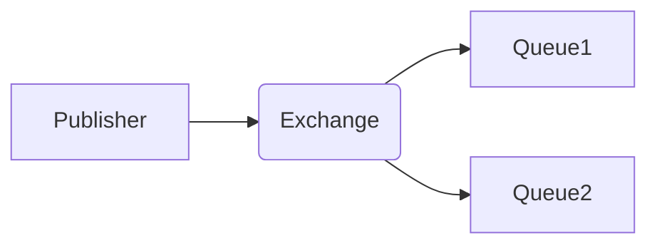

# Rabbitmq

[TOC]

## 简介

rabbitmq是一种基于AMQP（高级消息队列协议）的消息代理，它可以接受、存储和转发消息，但是不会去处理消息。

消息代理（message broker）从生产者那里接收消息，并根据一定的规则把消息发送给消费者。

AMQP是一种网络协议，可以让支持该协议的客户端和消息代理之间进行通信。其工作原理大概如下图：



### Exchange

Publisher发送消息不会直接发送到Queue中，而是先直接发送到交换机Exchange，Publisher并不知道消息已经发送到队列。也就是说Exchange承担着Publisher和Queue之间的桥梁，其一边从Publisher接收消息，一边向Queue投递消息。

当一个消息到达Exchange后，RabbitMQ会根据预先设定好的规则决定消息该投递到哪个Queue或者多个Queue。这些规则是通过Exchange type和`routing key`来定义的。

Binding: Exchange和Queue之间的联系称之为Binding(绑定)。

Routing key: 类似于Queue的地址，指明了Exchange中的消息应该分发到哪个满足条件的Queue中去。

**如果将消息发送到一个没有队列绑定的exchange上面，那么该消息将会丢失，这是因为在rabbitmq中exchange是不具备存储消息的能力，只有队具备存储消息的能力。**

Rabbitmq提供了四种Exchange type：

- **direct**：将消息中的`routing key`与该Exchange关联的所有绑定的Queue中的`routing key`进行比较，如果完全匹配，则发送到该Queue中。
- **topic**：将消息中的`routing key`与该Exchange所有绑定的Queue中的`routing key`进行某种模式的匹配比较，如果匹配上了，则发送到该Queue中。符号“#”表示一个或多个词，符号“*”表示一个词。
- **fonout**：消息转发的时候会忽略`routing key`，直接把消息投递到所有和Exchange绑定的Queue中，如果Exchange没有和任何Queue绑定，则消息会被丢弃。
- **headers**：这种类型的Exchange适用于当消息的路由操作涉及多个属性的时候，相比于`routing key`，headers exchange使用多个消息属性来建立路由规则，Exchange需要考虑某条消息是需要部分匹配还是全部匹配这些消息属性，并与该Exchange所有绑定的Queue中的消息属性进行匹配，如果匹配上了，则发送到该Queue中。





### Consumer

Rabbitmq采用的是Round Robin的轮询调度算法，也就是说不会因为某个消费者消费能力强就消费更多的消息，而是你一个我一个地轮流给消费者分发消息。

### VHost

每一个RabbitMQ服务器都能创建虚拟消息服务器，我们称之为虚拟主机。每一个vhost本质上是一个mini版的RabbitMQ服务器，拥有自己的交换机、队列、绑定等，拥有自己的权限机制。vhost之于Rabbit就像虚拟机之于物理机一样。他们通过在各个实例间提供逻辑上分离，允许为不同的应用程序安全保密的运行数据，这很有，它既能将同一个Rabbit的众多客户区分开来，又可以避免队列和交换器的命名冲突。RabbitMQ提供了开箱即用的默认的虚拟主机“/”，如果不需要多个vhost可以直接使用这个默认的vhost，通过使用缺省的guest用户名和guest密码来访问默认的vhost。

vhost之间是相互独立的，这避免了各种命名的冲突，就像App中的沙盒的概念一样，每个沙盒是相互独立的，且只能访问自己的沙盒，以保证非法访问别的沙盒带来的安全隐患。


## 安装

```bash
$ yum -y install erlang
$ wget http://www.rabbitmq.com/releases/rabbitmq-server/v3.6.6/rabbitmq-server-3.6.6-1.el6.noarch.rpm
$ yum -y install rabbitmq-server-3.6.6-1.el6.noarch.rpm
```

```bash
# 查看rabbitmq服务状态
$ service rabbitmq-server status
# 查看rabbitmq插件
$ rabbitmq-plugins list
# 启动rabbitmq web管理后台，默认端口15672
$ rabbitmq-plugins enable rabbitmq_management
# 创建用户和密码
$ rabbitmqctl add_user username password
# 赋予用户角色, tag可以为administrator, monitoring, policymarker, management或者其它自定义tag
$ rabbitmqctl set_user_tags username tags
# 查看用户权限
$ rabbitmqctl list_user_permissions username
# 设置用户权限
$ rabbitmqctl set_permissions [-p <vhost>] <user> <conf> <write> <read> 
```


## 基本用法

`pika == 0.12.0`

**生产者**：

```python
import time

import pika


credentials = pika.PlainCredentials('test', 'test1234')
# virtual_host 指明了客户端要使用哪个虚拟环境，虚拟环境为消息代理实现了多个隔离的环境。
connection_param = pika.ConnectionParameters(
    host='111.230.184.76',
    credentials=credentials,
    virtual_host='test_vhost'
)
connection = pika.BlockingConnection(connection_param)
# 新建channel，rabbitmq不会为每个连接建立TCP连接，而是在一个TCP连接上建立一个Channel。
# channel可以看作是一个TCP连接的轻量化连接，但是channel不能被线程/进程共享，不同channel之间的通信是相互隔离的
channel = connection.channel()
# 创建exchange
exchange = 'test_fanout'
channel.exchange_declare(exchange=exchange, exchange_type='fanout')

# 发布信息
count = 0
while count < 30:
    channel.basic_publish(exchange=exchange, routing_key='', body='{0}: Hello World'.format(count))
    time.sleep(2)
    count += 1

connection.close()
```

**消费者**：

```python
import pika

credentials = pika.PlainCredentials('test', 'test1234')
connection_param = pika.ConnectionParameters(
    host='111.230.184.76',
    credentials=credentials,
    virtual_host='test_vhost'
)
connection = pika.BlockingConnection(connection_param)
channel = connection.channel()
# exclusive = True 表示队列只能在当前连接中被访问
# auto_delete = True 表示队列是临时队列，connection关闭的时候这个队列会被删除
queue = channel.queue_declare(exclusive=True, auto_delete=True)
queue_name = queue.method.queue
channel.queue_bind(exchange='test_fanout', queue=queue_name)


def callback(ch, method, properties, body):
    print("recv msg: {0}".format(body))


channel.basic_consume(consumer_callback=callback, queue=queue_name)
channel.start_consuming()

connection.close()
```


## Push or Pull

RabbitMQ的消费模式就是兼具Push和Pull。

**push**

channel.basic_consume

订阅某一个队列中的消息，broker端主动向client端发送的数据，client端没有请求。除非关闭channel或者取消订阅，否则客户端将会一直接收队列的消息。

**pull**

channel.basic_get。broker端不会在client端没有请求的情况下来回传消息。

不可以通过循环调用basic_get来代替basic.consume，因为basic_get是主动去broker请求才会有数据返回，如果是高吞吐率的消费者，最好还是建议使用basic.consume。


## 死信队列

死信队列介绍

- 死信队列：DLX，`dead-letter-exchange`
- 利用DLX，当消息在一个队列中变成死信 `(dead message)` 之后，它能被重新publish到另一个Exchange，这个Exchange就是DLX

消息变成死信有以下几种情况

- 消息被拒绝(basic.reject / basic.nack)，并且requeue = false
- 消息TTL过期
- 队列达到最大长度

死信处理过程

- DLX也是一个正常的Exchange，和一般的Exchange没有区别，它能在任何的队列上被指定，实际上就是设置某个队列的属性。
- 当这个队列中有死信时，RabbitMQ就会自动的将这个消息重新发布到设置的Exchange上去，进而被路由到另一个队列。
- 可以监听这个队列中的消息做相应的处理。

在声明队列时，需要声明两个参数即可：`x-dead-letter-exchange`，`x-dead-letter-routing-key`。同时在声明普通队列之前声明死信队列：

```python
# 定义死信队列交换器
channel.exchange_declare("alert_ex_dlx",durable=True) 
channel.queue_declare(queue='alert_dlx', durable=True)
channel.queue_bind(queue="alert_dlx", 
                   exchange="alert_ex_dlx", 
                   routing_key="dlx_key")

# 定义普通队列和交换器
channel.exchange_declare(exchange='alert_ex', durable=True)
channel.queue_declare(queue='alert', 
                      durable=True,
                      arguments={
                        "x-dead-letter-exchange": "alert_ex_dlx",
                        "x-dead-letter-routing-key": "dlx_key",
                        "x-message-ttl": 100000}) 
channel.queue_bind(queue="alert", 
                   exchange="alert_ex", 
                   routing_key="alert_routing_key")

```


## 延时队列

所谓延迟队列，指的是消息发送后，并不想立即被消费者拿到，希望在指定时间后，消费者才拿到消息。

延迟队列可以用死信队列来实现。利用队列或消息的 TTL 特性，可以做到消息在指定时间内超时后被路由到死信队列，而此时死信队列就可以当做延迟队列来做消息处理。在普通队列的死信设置里加上一条 `x-message-ttl` 就可以设置消息的 TTL。`x-message-ttl`的单位是milliseconds。


##持久化

### 队列持久化

持久化的队列会存储在磁盘里，当消息代理重启的时候依然存在，持久化的队列不会使得消息持久化，当消息代理重启时持久化过的队列会被重新声明，但是消息不会重新恢复。

```python
channel.queue_declare(queue='durable_queue', durable=True)
```

生产者和消费者必须同时声明持久化队列，不然消费者会报错。

### 消息持久化

```python
channel.basic_publish(exchange='', 
                      routing_key='', 
                      body='hello world', 
                      properties=pika.BasicProperties(delivery_mode=2))
```

delivery_mode = 2 声明了消息持久化的属性


## 消息确认

消息代理有两种删除消息的方式：

- 当消息代理把消息发送给消费者后立刻删除。
- 当消息代理发送完消息后，等待消费者回发一个消息确认后再删除消息。如果接收到消息的消费者未发送消息确认的情况下挂掉，消息代理会把消息重新投递给另外一个消费者，如果没有可用消费者，消息代理会死等下一个注册到该队列的消费者再投递消息。

```python
channel.basic_consume(consumer_callback=callback, queue='test_queue', no_ack=True)
```

`no_ack` 默认为`False`。


## 事务

采用事务机制实现会降低RabbitMQ的消息吞吐量，事务的交互流程如下：

 1、客户端发送给服务器 Tx.Select（开启事务模式）
 2、服务器端返回 Tx.Select-Ok（开启事务模式ok）
 3、推送消息
 4、客户端发送给事务提交 Tx.Commit
 5、服务器端返回 Tx.Commit - Ok


## 确保消息不丢失

### 生产者

可能存在情况：

1. 消息发送后没有投放到指定队列。

发送方将信道设置成confirm (确认)模式, 一旦这样设置，这个信道上所有发布的消息都会被指定一个唯一的ID，消息被投递到所匹配的队列后，rabbitmq会发送一个包含消息唯一ID的确认信息给生产者，使生产者知道消息送达。

```python
# ...
# Turn on delivery confirmations
channel.confirm_delivery()
try:
    channel.basic_publish(exchange=exchange, routing_key='test', body='HelloWorld')
except Exception as e:
    print(e)
```

将当前的信道设置成事务模式后，可以显示提交事物，如果事物成功，则消息一定送达，如果不成功，可以回滚后重新发送。但是有性能损失。

```python
try:
		channel.tx_select() # 开启事物
		channel.basic_publish(exchange=exchange, routing_key='test', body='HelloWorld')
		channel.tx_commit() # 提交事物
except Exception as e:
		print(e)
		channel.tx_rollback() # 回滚事物
```

2. 消息routing_key不存在。

```python
def _basic_publish(self, msg, exchange='', routing_key='',
                   mandatory=False, immediate=False, timeout=None,
                   argsig='Bssbb'):
		"""
		mandatory: boolean
    indicate mandatory routing

    This flag tells the server how to react if the message cannot be routed to a queue.  
    If this flag is True, the server will return an unroutable message with a Return 
    method.  If this flag is False, the server silently drops the message.
    """       
    pass
```


### Broker

**持久化**

1. 队列持久化:定义队列时，设置队列的durable=True。服务重启后，队列不会丢失。

2. 交换器持久化:定义交换器时，设置durable=True。服务重启后，交换器元数据不会丢失。

3. 消息持久化: 将投递模式设置为2即可。服务重启后，队列里的消息不会丢失。

**高可用** 

​	设置 镜像队列

### 消费者

当消费者接收到消息后发生异常，没有正常消费消息

设置autoAck=False,关闭自动ack, 真正处理完成后，手动发送完成确认。如果没有ack确认 且当前消费者链接断开，任务会重新进入队列。

自动ack还有个弊端，只要队列不空，RabbitMQ会源源不断的把消息推送给客户端，而不管客户端能否消费的完

```python
def callback(ch, method, properties, body):

    try:
        print(f"msg:{body}")
    except Exception as e:
        print(e)
    finally:
        ch.basic_ack(delivery_tag=method.delivery_tag) # 手动 发送 真正任务完成 发送ack确认 如果没有ack确认 且当前消费者链接断开，任务会重新进入队列

channel.basic_consume(on_message_callback=callback, queue='queue', auto_ack=False) # 关闭auto_ack
```
但是如果callback触发了一个bug，导致所有消息都抛出异常，然后队列的Unacked消息数暴涨，导致MQ响应越来越慢，甚至崩溃的问题。
原因是如果MQ没得到ack响应，这些消息会堆积在Unacked消息里，不会抛弃，直至客户端断开重连时，才变回ready；
如果Consumer客户端不断开连接，这些Unacked消息，永远不会变回ready状态，Unacked消息多了，占用内存越来越大，就会异常了。
这时就需要`channel.basic_nack`方法了，这个方法解决了消费异常情况下该条消息怎么处理，有两种办法：第一，这条消息重新放回队列重新消费，第二，抛弃此条消息。

```python
def callback(ch, method, properties, body):  
    try:
        print(f"msg:{body}")
        assert 1==0		# "模拟出问题"
    except Exception as e:
        print(e)
        ch.basic_nack(delivery_tag=method.delivery_tag, requeue=True) # 发送nack, requeue=True, 拒绝消息并重新发送到队列 发送到队列的信息再收到还是会再次拒绝，进入死循环
        #ch.basic_reject(delivery_tag=method.delivery_tag, requeue=True) # 拒绝消息并重新发送到队列 发送到队列的信息再收到还是会再次拒绝，进入死循环
    else:
      	# 如果没有发生异常，执行else内代码
        ch.basic_ack(delivery_tag=method.delivery_tag) # 手动 发送 真正任务完成 发送ack确认 如果没有ack确认 且当前消费者链接断开，任务会重新进入队列
        
channel.basic_consume(on_message_callback=callback, queue='queue', auto_ack=False) # 关闭auto_ack
```
如果消息本身有问题，消费者抛出异常后把该消息重新发回队列中，队列又把该消息发回消费者，继续抛异常继续发回队列，就出现死循环的情况。

解决方法：开启死信队列 并设置`basic_nack`/`basic_reject`的requeue=False。这时当消息被拒绝或者nack时会被送入死信队列。消息过期，nack,reject,队列最大长度 这些情况，如果开启了死信队列，消息都会进入死信队列）。分析死信队列上的异常情况可以用来改善和优化系统。


## 集群


##一些问题

1. `error(-1, "ConnectionResetError(104, 'Connection reset by peer')")`

   原因：长时间没有数据来往服务断开了连接。

   处理：`heartbeat=600`，`heartbeat`并不是心跳发送的间隔，而是这么长时间没有与服务端通信则断开连接，在这个问题上可以尝试把`heartbeat`值调高。

   或者在每次发布消息前先判断连接状态（这个似乎并没啥用）：

   ```python
     if connection.is_closed or channel.is_closed:
         reset_conn_and_channel()
   ```

2. ```shell
   Task handler raised error: "TimeLimitExceeded(500,)" on_hard_timeout billiard/pool.py billiard.pool in on_hard_timeout
   ```

   原因：celery上配置了任务超时时间，超时了就把消费者worker kill了

   处理：改用task_soft_time_limit并捕获SoftTimeLimitExceeded异常。

